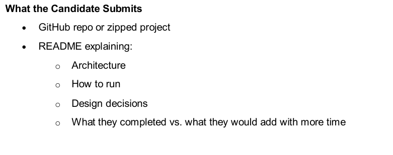

 

# HR Workflow Designer

---

## Architecture

The application is designed as a **modular, scalable frontend system** with clear separation of concerns.

### Folder Structure

```
src/
  components/      → UI components (Canvas, Panels, Sidebar, Toolbar)
  nodes/           → Custom node implementations
  store/           → Global state management (Zustand)
  api/             → Mock API layer
  types/           → TypeScript interfaces for workflow nodes
```

### Key Architectural Decisions

* **React Flow** is used to manage the workflow graph (nodes and edges)
* **Zustand** is used for global state management to avoid prop drilling
* **Custom node types** are implemented for flexibility and scalability
* **Separation of logic and UI**:

  * Canvas handles rendering
  * Store manages state
  * Components handle interaction

### Data Flow

```
User Action → Event Handler → Zustand Store Update → React Flow Re-render
```

---

## How to Run

### Prerequisites

* Node.js (v16 or above)
* npm

### Steps

```bash
npm install
npm run dev
```
---

## Design Decisions

### 1. React Flow for Workflow Canvas

React Flow provides built-in support for:

* Node-based UI
* Edge connections
* Zooming, panning, and minimap

This allows rapid development of a graph-based workflow system.

---

### 2. Zustand for State Management

Zustand was chosen because:

* Lightweight and simple
* Avoids deeply nested props
* Suitable for managing global graph state (nodes, edges, selected node)

---

### 3. TypeScript for Type Safety

TypeScript ensures:

* Strong typing of workflow nodes
* Better maintainability
* Reduced runtime errors

---

### 4. Modular Component Design

The UI is broken into independent components:

* WorkflowCanvas
* NodePalette (Sidebar)
* NodeFormPanel (Configuration)
* SimulationPanel

This makes the system extensible and easier to maintain.

---

### 5. Mock API Layer

A mock API layer is used to simulate backend behavior:

* `GET /automations` → fetch available automated actions
* `POST /simulate` → simulate workflow execution

---

## What I Completed

* Drag-and-drop workflow canvas using React Flow
* Custom node types (Start, Task, Approval, Automated, End)
* Node configuration panel with dynamic forms
* Global state management using Zustand
* Mock API integration for automations and simulation
* Workflow simulation panel displaying execution steps
* Clean and modular project structure

While building this project, I referred to online resources and documentation. I focused on understanding core concepts such as React Flow, state management, and component architecture, and ensured that I can explain, modify, and extend every part of the system.
---

## What I Would Add With More Time

* Graph validation:

  * Ensure Start node is first
  * Detect disconnected nodes or cycles
* Export/Import workflows as JSON
* Undo/Redo functionality
* Improved simulation visualization (timeline-based UI)
* Node templates for reusable workflows
* Enhanced error handling and user feedback

---
